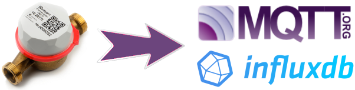

Прошивка для ESP32 для сбора данных со счетчиков Элехант СВД-15
===============================================================

Так как эти счетчики выдают показания сразу через Bluetooth LE,
их довольно удобно использовать в системе умного дома.
Однако производитель не предоставляет ни какой информации об протоколе,
и единственная возможность получить показания - воспользоваться официальным приложением
или выносным дисплеем.

Так как сообщения идут в широковещательном режиме,
то без какого-либо вмешательства в ПО прибора учета,
можно получить те-же данные, что и в оригинальном приложении.

И тут очень кстати ESP32, который позволяет сделать MQTT сенсор на одном чипе.

Лицензия
--------

Лицензировано на условиях GPL v3.

TODO
----
- [x] BLE sniffer
- [x] mfg data decoder
- [x] config
- [x] WiFi
- [x] MQTT client
- [ ] InfluxDB client (UDP)
- [ ] Watch dog
- [ ] NTP date
- [ ] LED indicate pkt sent
- [ ] OLED display (maybe)
- [ ] Home Assistant auto discovery
